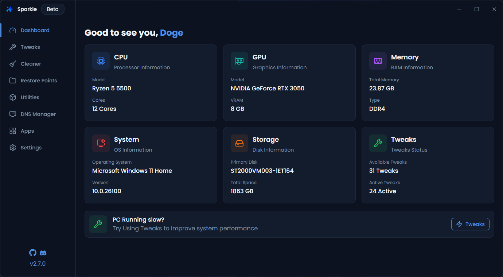

<div align="center">
  <a href="https://github.com/Parcoil/Sparkle">
    
  </a>

  <h3>Sparkle</h3>
  <p>Ultimate Windows Optimizer</p>

  <p>
    
    
    
    
    
  </p>

Install with Powershell:

```powershell
irm https://raw.githubusercontent.com/Parcoil/Sparkle/v2/get.ps1 | iex
```

<a href="https://github.com/Parcoil/Sparkle/releases/latest">Download Installer/Portable</a>

  <br/>
  <br/>

  

</div>
  
  > [!WARNING]
  > Sparkle is currently in beta. While we've tested it extensively, you may encounter some bugs. Please back up your system before applying tweaks and report any issues you find.

<div align="center">
  <h3>🚀 Features</h3>

  <ul align="left">
    <li>📈 Apply Tweaks to Optimize your system</li>
    <li>🗑️ Manage All Temp files in one place</li>
    <li>🎛️ Install apps with the built-in Winget integration</li>
    <li>📁 Backup and Revert changes</li>
    <li>⚙️ View Basic System info</li>
  </ul>
</div>

<div>
  <h2>📃 Docs</h2>
  <p>You can find the docs <a href="https://sparkle.parcoil.com">here</a></p>
  the docs cover all the tweaks how they work what they do and all of sparkles pages
</div>

<div>
  <h3>💖 Credits</h3>
  <ul>
    <li>
      <a href="https://github.com/ChrisTitusTech/winutil">CTT's WinUtil (Some of the tweaks & inspo for making this project)</a>
    </li>
    <li>
      <a href="https://github.com/Raphire/Win11Debloat">Win11Debloat (Main windows debloat script)</a>
    </li>
  </ul>

  <h3>👥 Contributing</h3>

  <h4>Adding New Tweaks</h4>
  <ul>
    <li>Tweaks are located in <code>resources/tweaks/</code></li>
    <li>More info in <code>resources/tweaks/readme.md</code></li>
  </ul>

  <h4>Other Ways to Contribute</h4>
  <ul>
    <li>🐛 Report bugs and issues</li>
    <li>💡 Suggest new features or improvements</li>
    <li>📝 Improve documentation</li>
    <li>🎨 Enhance the UI/UX</li>
    <li>🧪 Improve code quality</li>
  </ul>

<h4>🛠️ Building Sparkle</h4>

<p>To build sparkle you will need the following</p>
<ul>
  <li><b>Node.js</b> v22 or higher</li>
  <li><b>PNPM</b></li>
  <li><b>Windows 10/11</b></li>
</ul>

</div>

> [!IMPORTANT]
> The version of sparkle in the repo is most likely newer than the latest release. expect bugs and unreleased features

<ol>
  <li>
    <b>Clone the repository:</b>
    <pre><code>git clone https://github.com/Parcoil/Sparkle
cd Sparkle</code></pre>
  </li>
  <li>
    <b>Install dependencies:</b>
    <pre><code>pnpm install</code></pre>
  </li>
  <li>
    <b>Start the app in development mode:</b>
    <pre><code>pnpm dev</code></pre>
    <i>This will launch Sparkle with hot reload for both the Electron main and renderer processes.</i>
  </li>
  <br/>
  <li>
    <b>Build for production:</b>
    <pre><code>pnpm build</code></pre>
    <i>This will generate optimized production builds.</i>
  </li>
</ol>
 <br/>
  <p align="center">Made with ❤️ by Parcoil</p>

## Star History

<a href="https://www.star-history.com/#Parcoil/Sparkle&Date">
 <picture>
   <source media="(prefers-color-scheme: dark)" srcset="https://api.star-history.com/svg?repos=Parcoil/Sparkle&type=Date&theme=dark" />
   <source media="(prefers-color-scheme: light)" srcset="https://api.star-history.com/svg?repos=Parcoil/Sparkle&type=Date" />
   
 </picture>
</a>
